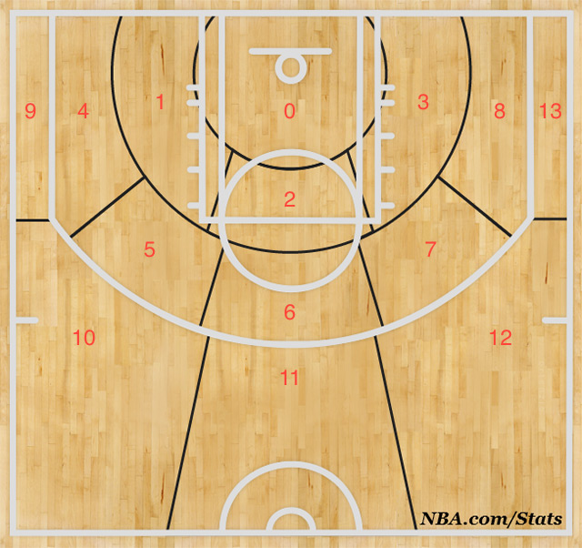
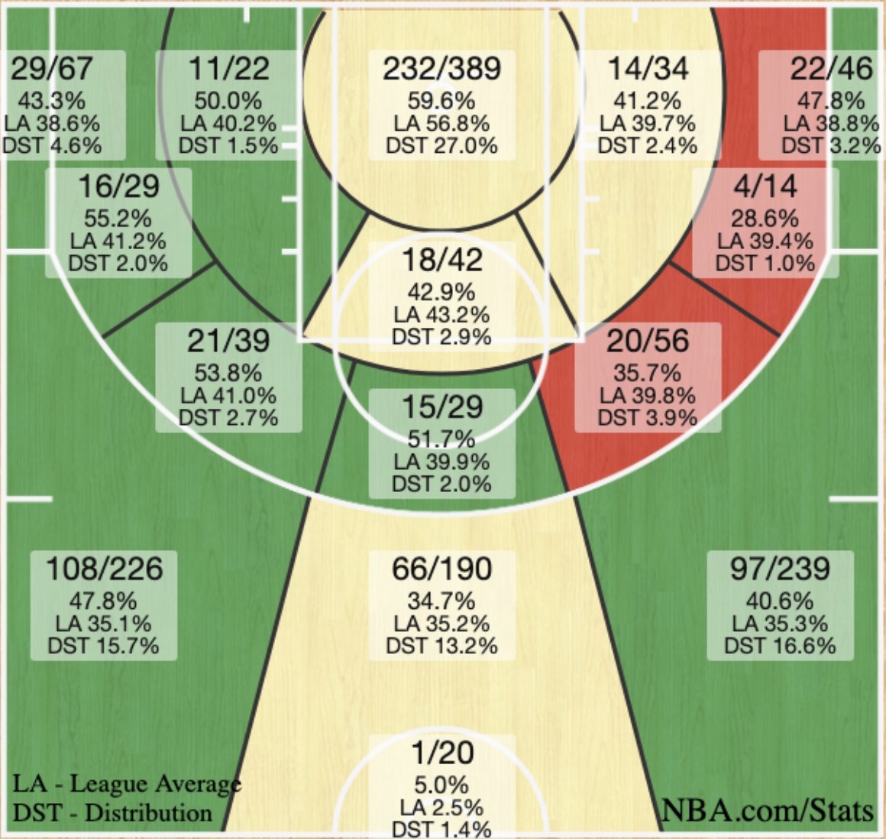

# 2019 NBA Hackathon Final Round
**Team: 4PPP**

**Members: Skyler Shi, Frank Li, Brandon Pollack, Faizan Abdullah**

## Quick Start

1. Download `Basketball` folder containing hackathon data from Box.
2. Move `Basketball` under this project's root directory.
3. Unzip the tracking files `CLEBOS.zip`, `CLEGSW.zip`, `SASGSW.zip` into same directory.
4. Run `Testing_Data.ipynb` to see data in pandas dataframes.

## Data Scrape
### shot_scrape.py
1. `url_to_df` function grabs json file in url and converts to pandas dataFrame. 
2. First grab the mapping from player name to player_id and their team info for 2016-17 season from https://stats.nba.com/leaders/?Season=2016-17&SeasonType=Regular%20Season page. The output file is called `player_info_1617.csv`.
3. Then grab shot detail json by iterating through every player_id.
4. Each output csv file is the shot detail for every single player.

### combine_csv_to_df.py
1. Concatenate csv files to a master one.

## Visualizing Everything
We want to visualize our work for easier understanding and intuition checks.

### Shot Charts
We use the NBA stats defined shot chart. The zones are indexed as below for easier coding.

Note that the above diagram was just used to label shotzones. The proportions of it are incorrect. We use the diagram from NBA stats to actually divide shot zones.

## App Interface
1. Get instructions on installing plotly here: https://plot.ly/python/getting-started/
2. Get instructions on installing dash here: https://dash.plot.ly/installation
3. Run `python app/interface.py` to start up app interface.
